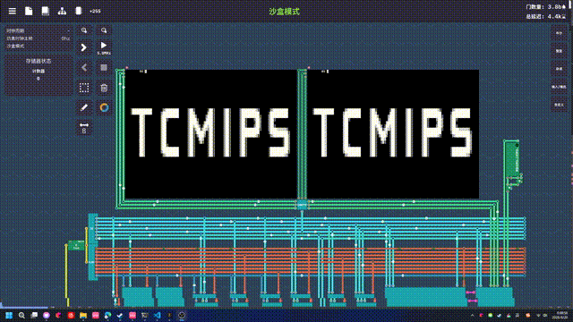
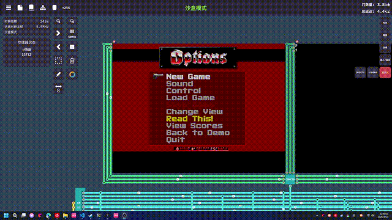

# TCMIPS-PlayGround

基于 TCMIPS 自定义 MIPS32 CPU(游戏 Turing Complete)的 C/C++ 小项目集。

使用官方 LLVM 交叉工具链把标准 C/C++ 源码编译为 `.tcm` 可执行文件,可直接在游戏内的
TCMIPS CPU 文件加载器(File Loader)中运行。目标硬件外设包括:像素屏、ASCII 文本屏、
键盘、双排八位七段数码管、Unix 时间戳 syscall。

## 演示



## 项目列表

| 可执行文件 | 说明 | 操作 |
|-----------|------|------|
| `tcmips_c` | Hello World 示例 | - |
| `tcmips_snake` | 贪吃蛇:吃食物变长加速,分数/长度实时显示在七段数码管 | 方向键移动,Q 退出,R 重开 |
| `tcmips_breakout` | 打砖块:三色砖块六关连闯,三条命 | 左右键移动挡板,上键发球,Q/R |
| `tcmips_guess` | 猜数字 0~9999,尝试次数与答案显示在七段数码管 | ASCII 屏键盘输入 |
| `tcmips_reaction` | 反应速度测试:等待 "NOW!" 出现后按键,微秒级计时 | 任意键,Q 退出 |
| `tcmips_clock` | 电子钟:天数 + 时:分:秒 | Q 退出 |
| `tcmips_life` | 康威生命游戏:80x60 环形网格,活细胞按代龄着色,可游标编辑 | 方向键移动,Enter 画/擦,Space 运行/暂停,S 单步,R 随机,C 清空,Q 退出 |
| `tcmips_xiangqi` | 中国象棋人机对战:完整规则 + α-β 剪枝搜索 AI,可选深度 | 方向键移动,Enter 选子/落子,退格取消,1-4 调 AI 深度,R 重开,Q 退出 |
| `tcmips_wolf3d` | Wolfenstein 3D(共享版第 1 章):Wolf4SDL 引擎移植,光线投射渲染、敌人 AI、10 关 | 见下方按键说明 |

## 目录结构

```
.
├── CMakeLists.txt                  # 构建配置(已内置工具链路径)
├── main.cpp                        # Hello World
├── asset/
│   ├── conway.gif / xiangqi.png    # 演示图
│   └── wolf3d/wolfdata.{h,cpp}     # Wolf3D 共享版 WL1 数据生成的嵌入数组(脚本生成物)
└── src/
    ├── common/
    │   └── tcm_util.h              # 延时 / 随机数工具(基于时间戳 syscall)
    ├── tools/
    │   └── clock.cpp               # 电子钟
    ├── games/
    │   ├── snake.cpp               # 贪吃蛇
    │   ├── breakout.cpp            # 打砖块
    │   ├── guess.cpp               # 猜数字
    │   ├── reaction.cpp            # 反应速度测试
    │   ├── life.cpp                # 生命游戏
    │   └── xiangqi.cpp             # 中国象棋 AI
    └── wolf3d/                     # Wolfenstein 3D(Wolf4SDL 引擎移植)
        ├── tcm_port.h              # SDL 兼容垫片:类型/键值/时钟
        ├── tcm_files.{h,cpp}       # 只读"文件"层:直接访问嵌入的 WL1 数据
        ├── id_*.cpp/h              # 引擎底层:缓存管理(CA)/页管理(PM)/视频(VL/VH)/输入(IN)/声音(SD 桩)
        └── wl_*.cpp                # 游戏逻辑:主循环/菜单/渲染/AI/关卡
```

## Wolfenstein 3D

TCMIPS 移植版基于 [Wolf4SDL](https://github.com/mozzwald/wolf4sdl)(GPL-2.0,
id Software 1995 年开源的 Wolf3D 引擎的现代 SDL 移植),数据使用官方共享版
v1.4(Apogee 1992,可自由分发)。WL1 文件以常量数组嵌入固件(~1.1MB),
运行时按原版算法 Huffman/Carmack/RLEW 解压;视频为 8 位调色板缓冲 +
RGB32 LUT 上屏;音频(OPL2/数字化音效)已桩掉。

固件约 1.73MB,真机需 ≥16MB 内存(实测可用)。宿主机上用桩外设可完整跑通
开机 → 标题 → 菜单 → 游戏内 3D 渲染。

启动时先在文本屏选择画质(帧率从上到下递增):

```
1 = Full     304x182   (slowest)
2 = Medium   208x126
3 = Small    144x82
4 = Tiny      96x54    (fastest)
Half-res columns? y/N   ← 隔列渲染:每列光线算一次、画两像素宽,约再快一倍
```

按键(TCMIPS 键盘无 ESC,已重映射):

| 场景 | 按键 |
|------|------|
| 标题/演示画面 → 进菜单 | 任意键 |
| 菜单返回上级 / 游戏中呼出菜单 | Backspace(= ESC) |
| 移动 / 转向 | 方向键 |
| 开枪 | Ctrl |
| 开门 / 互动 | 空格 |
| 跑步 | Shift |
| 平移(strafe) | Tab + 方向键 |
| 切换武器 | 1-4 |

## 构建

从本仓库 Release 页面下载打包好的 TCMIPS 工具链,按系统选择其一,解压到项目根目录:

- `tcmips-2.1-toolchains-x86_64-linux-gnu.zip` — Linux
- `tcmips-2.1-toolchains-x86_64-mingw64.zip` — Windows

```
toolchains/
├── cmake/tcmips.toolchain.cmake
├── llvm/bin/{clang,clang++,llvm-link-tcmips}
└── sysroot/
```

命令行构建:

```bash
cmake -G Ninja -S . -B build -DCMAKE_BUILD_TYPE=Release
cmake --build build
```

> `CMakeLists.txt` 已内置 `CMAKE_TOOLCHAIN_FILE` 路径,只要工具链已解压到项目根目录,
> 无需再手动指定。CLion 中同样直接创建一个 CMake 配置(生成器选 Ninja)即可构建。

构建产物 `build/tcmips_*.tcm` 即为可加载的固件镜像。

## 致谢

本项目基于 [zhangjiantao/tcmips](https://github.com/zhangjiantao/tcmips) 的 TCMIPS CPU 架构、
交叉编译工具链与 sysroot 开发,原作者为 [zhangjiantao](https://github.com/zhangjiantao)。

## 注意事项

- C++ 编译时禁用了异常与 RTTI(`-fno-exceptions -fno-rtti`)
- 目标为 `mipsel` MIPS32r2 软浮点,64 位整数与浮点由编译器 runtime 软件模拟
- 各游戏共用 `src/tcm_util.h` 中基于时间戳 syscall 的忙等待延时(裸机环境无可靠 sleep)
