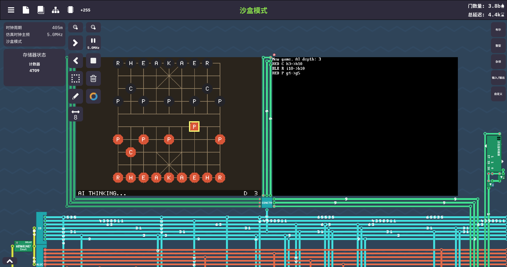

# TCMIPS-PlayGround

基于 TCMIPS 自定义 MIPS32 CPU(游戏 Turing Complete)的 C/C++ 小项目集。

使用官方 LLVM 交叉工具链把标准 C/C++ 源码编译为 `.tcm` 可执行文件,可直接在游戏内的
TCMIPS CPU 文件加载器(File Loader)中运行。目标硬件外设包括:像素屏、ASCII 文本屏、
键盘、双排八位七段数码管、Unix 时间戳 syscall。

## 演示



## 项目列表

| 可执行文件 | 说明 | 操作 |
|-----------|------|------|
| `tcmips_c` | Hello World 示例 | - |
| `tcmips_snake` | 贪吃蛇:吃食物变长加速,分数/长度实时显示在七段数码管 | 方向键移动,Q 退出,R 重开 |
| `tcmips_breakout` | 打砖块:三色砖块六关连闯,三条命 | 左右键移动挡板,上键发球,Q/R |
| `tcmips_guess` | 猜数字 0~9999,尝试次数与答案显示在七段数码管 | ASCII 屏键盘输入 |
| `tcmips_reaction` | 反应速度测试:等待 "NOW!" 出现后按键,微秒级计时 | 任意键,Q 退出 |
| `tcmips_clock` | 电子钟:天数 + 时:分:秒 | Q 退出 |
| `tcmips_life` | 康威生命游戏:80x60 环形网格,活细胞按代龄着色,可游标编辑 | 方向键移动,Enter 画/擦,Space 运行/暂停,S 单步,R 随机,C 清空,Q 退出 |
| `tcmips_xiangqi` | 中国象棋人机对战:完整规则 + α-β 剪枝搜索 AI,可选深度 | 方向键移动,Enter 选子/落子,退格取消,1-4 调 AI 深度,R 重开,Q 退出 |
| `tcmips_atari` | Atari 2600 模拟器:6507 CPU + TIA + RIOT 定时器 + F8/F6/F4 及读触发 bank 切换,内置 3 个可玩 ROM | 启动选游戏,方向键+空格=P0 摇杆,W/A/S/D=P1,R 重开,F 按住复位 |

## 目录结构

```
.
├── CMakeLists.txt                  # 构建配置(已内置工具链路径)
├── main.cpp                        # Hello World
├── asset/
│   └── roms/
│       ├── a2600asm.py              # 自研 6502 汇编器(两遍扫描,供自制 ROM 使用)
│       ├── pong.asm / pong.bin / pong.h   # 自制 Pong 演示 ROM 源码/产物/嵌入数组
│       ├── oystron.bin / oystron.h        # Oystron 4K 免费软件(Piero Cavina,含授权文档 OYSTRON.DOC)
│       └── thrust.bin / thrust.h          # Thrust 16K 公有领域(Thomas Jentzsch,含说明 THRUST.TXT)
└── src/
    ├── common/
    │   └── tcm_util.h              # 延时 / 随机数工具(基于时间戳 syscall)
    ├── emulators/
    │   ├── atari_2600.h            # Atari 2600 模拟器:6507 CPU + TIA(纯 C++,双端可编译)
    │   └── atari_2600.cpp
    ├── tools/
    │   ├── clock.cpp               # 电子钟
    │   └── atari.cpp               # Atari 2600 模拟器外壳(键盘映射 + 调色板 + 缩放)
    └── games/
        ├── snake.cpp               # 贪吃蛇
        ├── breakout.cpp            # 打砖块
        ├── guess.cpp               # 猜数字
        ├── reaction.cpp            # 反应速度测试
        ├── life.cpp                # 生命游戏
        └── xiangqi.cpp             # 中国象棋 AI
```

## 构建

从本仓库 Release 页面下载打包好的 TCMIPS 工具链,按系统选择其一,解压到项目根目录:

- `tcmips-2.1-toolchains-x86_64-linux-gnu.zip` — Linux
- `tcmips-2.1-toolchains-x86_64-mingw64.zip` — Windows

```
toolchains/
├── cmake/tcmips.toolchain.cmake
├── llvm/bin/{clang,clang++,llvm-link-tcmips}
└── sysroot/
```

命令行构建:

```bash
cmake -G Ninja -S . -B build -DCMAKE_BUILD_TYPE=Release
cmake --build build
```

> `CMakeLists.txt` 已内置 `CMAKE_TOOLCHAIN_FILE` 路径,只要工具链已解压到项目根目录,
> 无需再手动指定。CLion 中同样直接创建一个 CMake 配置(生成器选 Ninja)即可构建。

构建产物 `build/tcmips_*.tcm` 即为可加载的固件镜像。

## Atari 2600 模拟器与 ROM 替换

模拟器(`src/emulators/atari_2600.{h,cpp}`)实现了 6507 CPU(151 条指令)、TIA 逐行
渲染(精灵/弹球/playfield、碰撞锁存、RESP 时序)、RIOT 定时器与 IO,以及 F8/F6/F4
写触发与读触发两种 bank 切换(4K~32K ROM 自动识别)。内置 3 个游戏:

1. **Pong** — 自制演示 ROM,`asset/roms/pong.asm` 用自研汇编器 `a2600asm.py` 生成
2. **Oystron** — Piero Cavina 的免费软件(1997),4K 单 bank
3. **Thrust v1.27** — Thomas Jentzsch 的公有领域移植,16K 四 bank(读触发切换)

### 放入自己的 ROM

1. 准备 ROM 二进制(4K/8K/16K/32K,或 2K)。商业 ROM 请只使用自己合法拥有的拷贝;
   免费软件请遵循作者许可(见随附文档)。
2. 生成 C++ 嵌入数组(格式与 `asset/roms/pong.h` 一致):
   ```bash
   python3 - <<'EOF'
   d = open('your_rom.bin', 'rb').read()
   print('#include <cstdint>')
   print('static const uint8_t MY_ROM[%d] = {' % len(d))
   for i in range(0, len(d), 12):
       print('  ' + ', '.join('0x%02x' % b for b in d[i:i+12]) + ',')
   print('};')
   EOF
   ```
3. 在 `src/tools/atari.cpp` 顶部 `#include` 新数组,并在 `ROMS[]` 菜单中加一行
   (名称 + 数组 + 大小),重新编译即可,启动菜单会多出该游戏。

自制 ROM 可参考 `asset/roms/pong.asm`,用 `a2600asm.py` 汇编:

```bash
python3 asset/roms/a2600asm.py game.asm | tail -c 4096 > game.bin
```

## 致谢

本项目基于 [zhangjiantao/tcmips](https://github.com/zhangjiantao/tcmips) 的 TCMIPS CPU 架构、
交叉编译工具链与 sysroot 开发,原作者为 [zhangjiantao](https://github.com/zhangjiantao)。

## 注意事项

- C++ 编译时禁用了异常与 RTTI(`-fno-exceptions -fno-rtti`)
- 目标为 `mipsel` MIPS32r2 软浮点,64 位整数与浮点由编译器 runtime 软件模拟
- 各游戏共用 `src/tcm_util.h` 中基于时间戳 syscall 的忙等待延时(裸机环境无可靠 sleep)
